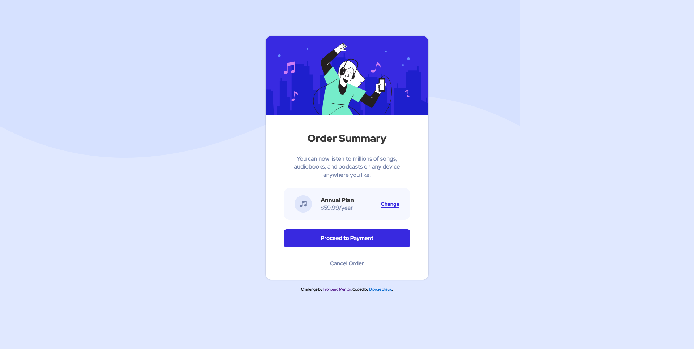
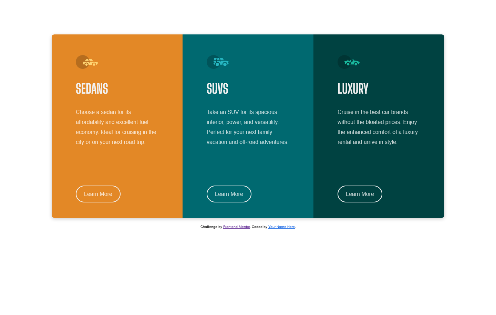
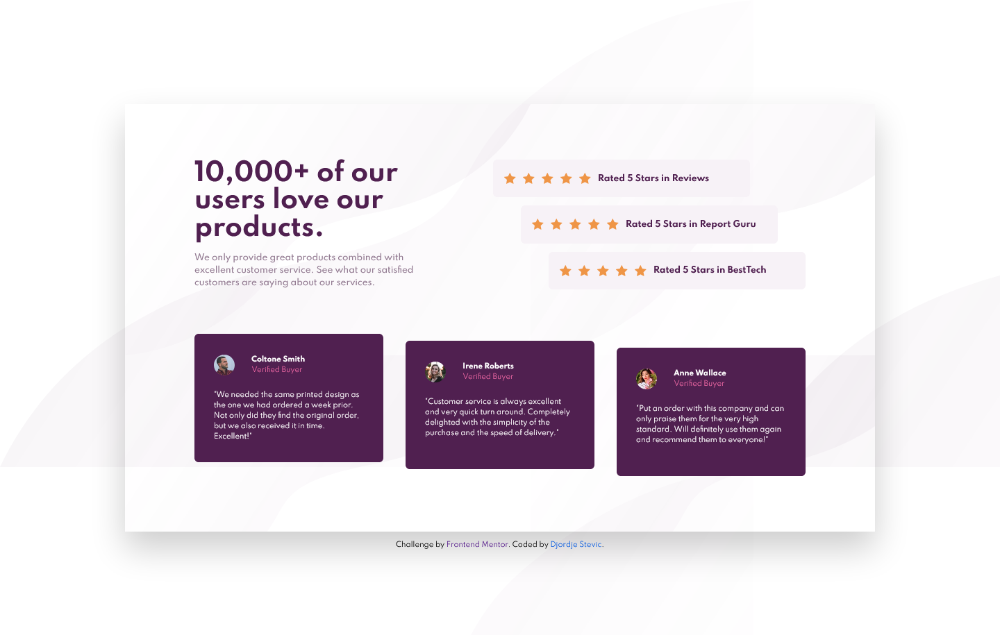
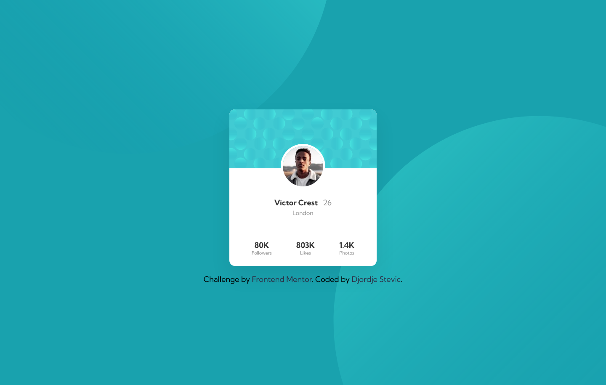

# Frontend Mentor Solutions 👨🏻‍💻

After completing [https://www.udemy.com/course/design-and-develop-a-killer-website-with-html5-and-css3/](Build-Responsive-Real-World-Websites-with-HTML-and-CSS) by Jonas Schmedtmann I've decided to practice by going through challenges on Frontend Mentor. Will be taking each challenge from every level. HTML and CSS first to get some practice before moving on to JS.

| Difficulty | Table of Contents                                                   |
| ---------- | ------------------------------------------------------------------- |
| NEWBIE     | [Order Summary Component](#order-summary-component)                 |
| NEWBIE     | [Stats-preview-card](#Stats-preview-card)                           |
| NEWBIE     | [3-column preview card component](#3-column-preview-card-component) |
| NEWBIE     | [Social proof section](#Social-proof-section)                       |
| NEWBIE     | [Profile card](#Profile-card)                                       |

## Order Summary Component

- Live Site URL: [https://djokaras.github.io/order-summary-component/](https://djokaras.github.io/order-summary-component/)
- Repository URL: [https://github.com/Djokaras/order-summary-component](https://github.com/Djokaras/order-summary-component)
- Solution URL: [https://www.frontendmentor.io/challenges/order-summary-component-QlPmajDUj/hub/flexbox-desktop-first-mCpLz7h-H/](https://www.frontendmentor.io/challenges/order-summary-component-QlPmajDUj/hub/flexbox-desktop-first-mCpLz7h-H/)

## Stats-preview-card

- Live Site URL: [https://djokaras.github.io/Stats-preview-card/](https://djokaras.github.io/Stats-preview-card/)
- Repository URL: [https://github.com/Djokaras/Stats-preview-card](https://github.com/Djokaras/Stats-preview-card)
- Solution URL: [https://www.frontendmentor.io/solutions/grid-flexbox-for-layout-pseudo-class-for-violet-color-wDjVQcnhC/](https://www.frontendmentor.io/solutions/grid-flexbox-for-layout-pseudo-class-for-violet-color-wDjVQcnhC/)

## 3-column preview card component

- Live Site URL: [https://djokaras.github.io/3-column-preview-card-component/](https://djokaras.github.io/3-column-preview-card-component/)
- Repository URL: [https://github.com/Djokaras/3-column-preview-card-component](https://github.com/Djokaras/3-column-preview-card-component)
- Solution URL: [https://www.frontendmentor.io/solutions/css-grid-without-media-queries-2M_KD2UP2/](https://www.frontendmentor.io/solutions/css-grid-without-media-queries-2M_KD2UP2/)

## Social proof section

- Live Site URL: [https://djokaras.github.io/Social-proof-section/](https://djokaras.github.io/Social-proof-section/)
- Repository URL: [https://github.com/Djokaras/Social-proof-section](https://github.com/Djokaras/Social-proof-section)
- Solution URL: [https://www.frontendmentor.io/solutions/css-grid-flexbox-YUpByXzP1/](https://www.frontendmentor.io/solutions/css-grid-flexbox-YUpByXzP1/)

## Profile card

- Live Site URL: [https://djokaras.github.io/profile-card-component/](https://djokaras.github.io/profile-card-component/)
- Repository URL: [https://github.com/Djokaras/profile-card-component](https://github.com/Djokaras/profile-card-component)
- Solution URL: [https://www.frontendmentor.io/solutions/flexbox-Q9vD-8rPa/](https://www.frontendmentor.io/solutions/flexbox-Q9vD-8rPa/)
